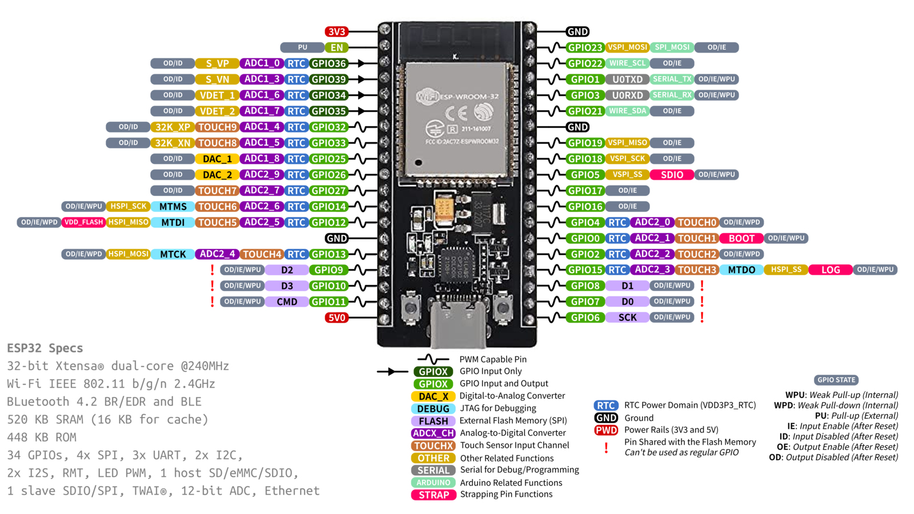

#ESP Introducción

El ESP32 es un conjunto de minicontroladores que permite el control y ejecución de proyectos con una conexión Bluetooth y WI-FI.

Como tal, este es muy similar a un Arduino, pudiéndose programar con el mismo bloc de notas, pero este tiene la ventaja de que tiene muchos más pines para mejor procesamiento, la creación de proyectos más grandes si es necesario y, como anteriormente mencionado, la opción de poder controlarlo de manera Bluetooth.

## Proyecto 1

El primer uso que le dimos al ESP fue en un proyecto, el cual se enfocó en poder usar delays para encender y apagar un led.

## Proyecto 2

El segundo uso de la ESP consistió en ahora añadirle botones al código previamente utilizado. Cuando el botón fuera presionado, el LED encendería, y cuando este no esté presionado, debe permanecer apagado.

## Proyecto 3

El tercer uso del LED consistió en poder encender el LED por medio de la conexión Bluetooth del ESP, generando un código que lea el INPUT del mensaje por Bluetooth del celular al ESP, los cuales están conectados por esta vía inalámbrica. Cuando el ESP recibiera un 1, el led debería encender, y cuando reciba un 0, se apaga.

## Evidencias

1. https://youtube.com/shorts/S92fErVGLRo?feature=share

2. https://youtube.com/shorts/ofZKnvaHk9Y?feature=share

3. https://youtube.com/shorts/QJc2S6VjcBQ?feature=share
