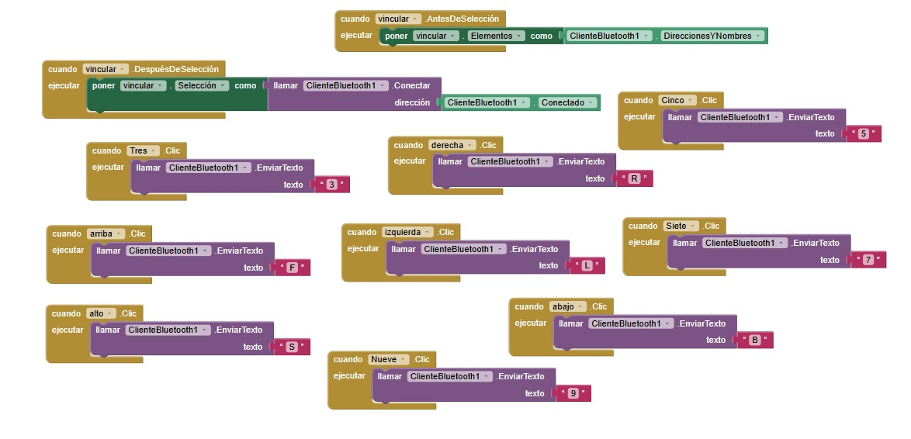
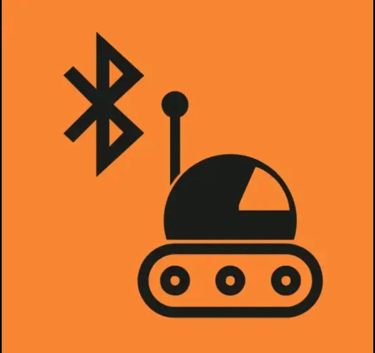
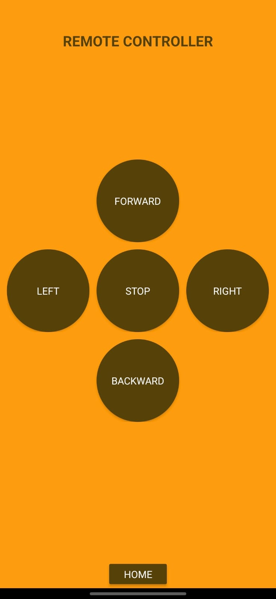

## 1) Resumen

- **Nombre del proyecto:** _Carritos con motores DC_  
- **Equipo / Autor(es):** _Emily Mendez, Aldo Fernandez, Alexandra Groot, Valeria Piña, Arturo Martínez, Sebastian Rodríguez, Erik Zepeda_  
- **Curso / Asignatura:** _Introducción a la Mecatrónica_  
- **Fecha:** _15/10/2025_  
- **Descripción breve:** _Desarrollo de un carrito a control remoto con bases de motores DC, puente H, ESP32, Control Bluetooth, etc._
  

## 2) Objetivos

**General:** 

_Aplicar los conocimientos vistos en clase para diseñar y construir un coche a control remoto que pueda competir con los de otros equipos.._

**Específicos:**

- _Hacer un sistema que permita mover el coche de forma rápida y controlada para atrapar una pelota y anotar goles._

- _Lograr meter más goles que el equipo contrario durante la competencia._


## 3) Alcance y Exclusiones

- **Incluye:** _Diseñar y construir un coche con materiales propios, con un sistema de movimiento dinámico y control remoto por Bluetooth, en un tiempo de alrededor de dos semanas._


## 4) Planeación

Para comenzar el proyecto, el equipo se dividió en tareas. Dos integrantes se encargaron del diseño del coche, y los demás trabajaron en la parte electrónica y de programación. Así se pudo avanzar de manera más rápida y organizada.

La lista de materiales que usamos fue la siguiente:

- Puente H

- Dos motores DC

- Protoboard

- Microcontrolador ESP32

- Jumpers

- Luces LED

- Pila de 9V

También se utilizó MDF para construir la estructura del coche y PLA para imprimir en 3D una pala que sirviera para empujar la pelota hacia la portería del otro equipo.


## 5) Desarrollo

### Electrónica

Primero, se conectaron los motores a las bases hechas de MDF y luego al puente H. Se revisó que la corriente y la conexión a tierra estuvieran bien.

Los pines IN1, IN2, IN3 e IN4 se conectaron para que los motores pudieran girar hacia adelante y hacia atrás según fuera necesario.

Después, se conectó la ESP32, revisando las hojas de datos y cuidando que no hubiera cortos. Los pines usados se definieron más tarde en el código de programación.


### Programación

Con las conexiones listas, se desarrolló un código para controlar el coche desde un celular mediante Bluetooth.

Se crearon varias funciones: una para avanzar, otra para retroceder, una para girar a la derecha, otra a la izquierda y una más para detener el coche.

Para controlar la velocidad y los giros se utilizó PWM (modulación por ancho de pulso). Por ejemplo:

- Si gira a la izquierda, la llanta derecha se detiene y la izquierda sigue girando.

- Si gira a la derecha, se hace lo contrario.

- Para avanzar, ambas llantas giran a la misma velocidad.

- Para detenerse, las dos se apagan.

También se agregó una función que permite cambiar la velocidad del coche dependiendo del número que se envíe desde la aplicación Bluetooth.


``` codigo
#include "BluetoothSerial.h"
 
BluetoothSerial SerialBT;


// Pines del puente H
 
const int IN1 = 12; // Motor izquierdo
 
const int IN2 = 11;
 
const int ENA = 13;
 
const int IN3 = 10; // Motor derecho
 
const int IN4 = 9;
 
const int ENB = 7;
 
int valSpeed = 255;


void setup() {
 
  Serial.begin(115200);
 
  SerialBT.begin("CarroESP32"); // Nombre del dispositivo Bluetooth
 
  pinMode(IN1, OUTPUT);
 
  pinMode(IN2, OUTPUT);
 
  pinMode(ENA, OUTPUT);
 
  pinMode(IN3, OUTPUT);
 
  pinMode(IN4, OUTPUT);
 
  pinMode(ENB, OUTPUT);
 
  stopMotors();
 
}


void loop() {
 
  if (SerialBT.available()) {
 
    char command = SerialBT.read();
 
    Serial.println(command);
 
    switch (command) {
 
      case 'F': forward(); break;
 
      case 'B': backward(); break;
 
      case 'L': turnLeft(); break;
 
      case 'R': turnRight(); break;
 
      case 'S': stopMotors(); break;
 
      case '0': setSpeed(0); break;
 
      case '1': setSpeed(25); break;
 
      case '2': setSpeed(50); break;
 
      case '3': setSpeed(75); break;
 
      case '4': setSpeed(100); break;
 
      case '5': setSpeed(125); break;
 
      case '6': setSpeed(150); break;
 
      case '7': setSpeed(175); break;
 
      case '8': setSpeed(200); break;
 
      case '9': setSpeed(255); break;
 
    }
 
  }
 
}


void forward() {
 
  analogWrite(ENA, valSpeed);
 
  analogWrite(ENB, valSpeed);
 
  digitalWrite(IN1, HIGH);
 
  digitalWrite(IN2, LOW);
 
  digitalWrite(IN3, HIGH);
 
  digitalWrite(IN4, LOW);
 
}


void backward() {
 
  analogWrite(ENA, valSpeed);
 
  analogWrite(ENB, valSpeed);
 
  digitalWrite(IN1, LOW);
 
  digitalWrite(IN2, HIGH);
 
  digitalWrite(IN3, LOW);
 
  digitalWrite(IN4, HIGH);
 
}


void turnLeft() {
 
  analogWrite(ENA, valSpeed / 2);
 
  analogWrite(ENB, valSpeed);
 
  digitalWrite(IN1, HIGH);
 
  digitalWrite(IN2, LOW);
 
  digitalWrite(IN3, HIGH);
 
  digitalWrite(IN4, LOW);
 
}


void turnRight() {
 
  analogWrite(ENA, valSpeed);
 
  analogWrite(ENB, valSpeed / 2);
 
  digitalWrite(IN1, HIGH);
 
  digitalWrite(IN2, LOW);
 
  digitalWrite(IN3, HIGH);
 
  digitalWrite(IN4, LOW);
 
}


void stopMotors() {
 
  analogWrite(ENA, 0);
 
  analogWrite(ENB, 0);
 
  digitalWrite(IN1, LOW);
 
  digitalWrite(IN2, LOW);
 
  digitalWrite(IN3, LOW);
 
  digitalWrite(IN4, LOW);
 
}

 
void setSpeed(int val) {
 
  valSpeed = val;
 
}
```


### Aplicación

Para controlar el coche, se usó una aplicación desarrollada por un compañero. Esta app permite asignar letras a cada botón, que luego se envían por Bluetooth a la ESP32.

Se configuraron así:

- F: Avanzar

- B: Retroceder

- L: Izquierda

- R: Derecha

- S: Detener

Cada vez que se presiona un botón, la aplicación manda la letra y la ESP32 ejecuta la acción correspondiente.








## 6) Resultados y Evidencias

Antes del concurso, el coche funcionó correctamente: respondía bien a los comandos, las luces LED se encendían sin problema, la pala 3D encajó bien y el diseño del coche fue atractivo.

Durante la competencia, surgieron algunos problemas. Uno de los motores se cayó cuando la pala se atoró con una silla, y aunque se volvió a asegurar, volvió a soltarse en la segunda ronda. Además, el control Bluetooth respondía con algo de retraso y los movimientos eran un poco bruscos.

A pesar de eso, el funcionamiento general fue bueno. El coche cumplió con lo planeado, aunque no logró anotar goles ni obtener un lugar destacado.


https://youtube.com/shorts/-BoEvhaO5zg?feature=share

https://youtu.be/CgaybSU6_40


## 7) Conclusiones

El proyecto y la competencia fueron una buena experiencia. La planeación y ejecución fueron adecuadas para el tiempo disponible. El coche funcionó correctamente y cumplió con los objetivos del curso.

Sin embargo, se detectaron algunas mejoras posibles:

- Hacer más pruebas antes de la competencia.

- Asegurar mejor los motores.

- Practicar más con la aplicación para mejorar el control.

En términos generales, el proyecto permitió poner en práctica los conocimientos adquiridos en la materia de Introducción a la Mecatrónica. Además, contribuyó a comprender de manera más clara la integración entre la electrónica, la mecánica y la programación. También evidenció que, para lograr un buen resultado, es necesario realizar numerosas pruebas y dedicar el tiempo suficiente para obtener un proyecto funcional y con el menor número posible de fallas.
