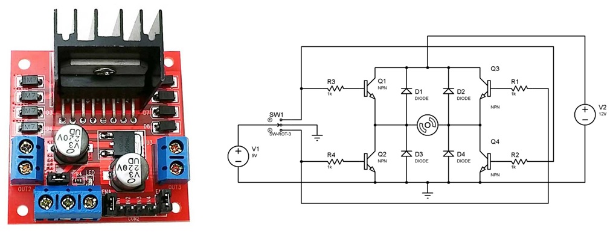
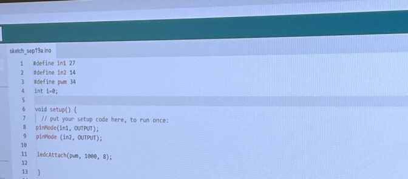
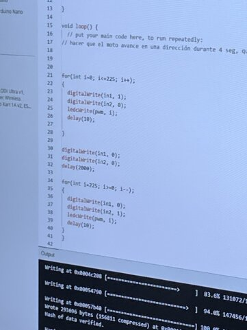
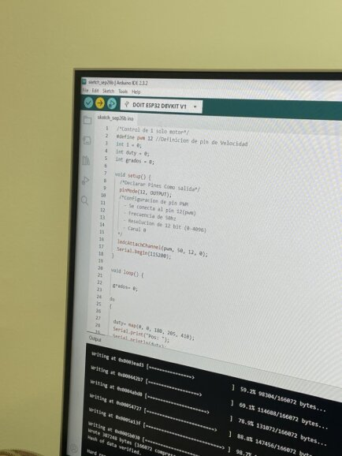
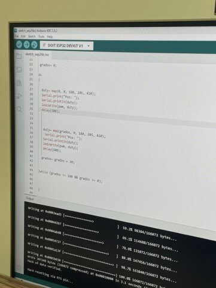
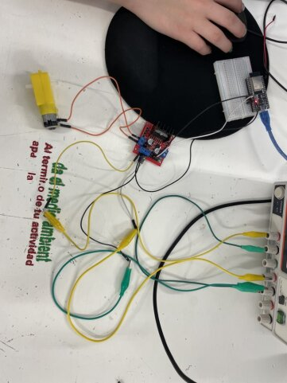
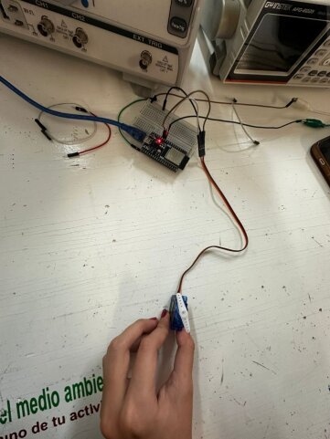

# Actuadores Introducción

Los actuadores son dispositivos electrónicos y electromecánicos que convierten energía en movimiento o fuerza. Estos son muy útiles en términos de automatización de proyectos.

En el caso de lo que se aprendió a usar, se utilizaron mayormente motores DC y al final servomotores.

Algo muy importante de este tipo de motores es que funcionan con un cierto voltaje (12 V el DC y 5 V los servo) y que tienen una característica conocida como PWM.

El PWM (Modulación por Ancho de Pulsos) es un control de la energía que un motor usa, o en general una gran cantidad de dispositivos de corriente continua. En el caso de los motores, la regulación de la energía permite un mejor control sobre el funcionamiento y la velocidad con la que gira o se mueve el motor. Al variar el ciclo de trabajo (el porcentaje de tiempo que la señal está encendida), se puede controlar la velocidad y el comportamiento del motor de forma eficiente.

También es importante saber qué es la resolución, la cual se define como la precisión con la que se puede controlar la velocidad o posición del motor. Este funciona con bits, y por ejemplo, si al motor se le programa con 12 bits, significa que el motor tendrá de 0 a 4096. Esto representa que el motor puede tener 4096 diferentes niveles en los que se mueva.

La diferencia principal entre PWM y resolución es que PWM es un control enfocado a la energía, y la resolución es un control al mecanismo. El PWM controla cuánta energía recibe el motor, y la resolución, qué tan fino es el control del motor.

Podemos decir que la resolución define cuántos niveles puede tener el PWM, y el PWM determina cuánta energía se entrega en cada nivel.

## Puente H

El puente H es un circuito que se utiliza para regular energía y controlar el funcionamiento de motores DC. Tiene las conexiones de IN1 a las permitidas por el puente H, y estas se utilizan para conectar las polaridades de uno o más motores. Junto a esto, el puente se alimenta con mínimo 5 V y tiene pins out para conectarlos a un microcontrolador o a una protoboard.





## Motor DC

Con el motor DC nos enfocamos durante la práctica a poder hacerlo girar de un lado a otro, y luego escalarlo para que luego regresara al 0.


``` codigo

/*Control de 1 solo motor*/

define in1 27

define in2 14


void setup() {

  pinMode(in1, OUTPUT);

  pinMode(in2, OUTPUT);

}


void loop() {


  /*ADELANTE*/

  digitalWrite(in1, 0);
  
  digitalWrite(in2, 1);
  
  delay(1000);

  
  /*ALTO*/

  digitalWrite(in1, 0);
  
  digitalWrite(in2, 0);
  
  delay(1000);

  
  /*ATRAS*/

  digitalWrite(in1, 1);
  
  digitalWrite(in2, 0);
  
  delay(1000);

  
  /*ALTO*/

  digitalWrite(in1, 0);
  
  digitalWrite(in2, 0);
  
  delay(1000);
  
}
```

Con el código anterior, el motor va a toda velocidad, pero para controlar esta velocidad con el PWM se hace:

``` codigo
- #define PWM 12 // pin de velocidad
- En voidSetup:
ledcAttachChannel(pwm, 1000, 8, 0); 
```

-ledcAttachChannel= comando del ESP32

pwm=pin=12

1000 = frecuencia

8 = resolución = (2^8 = 225. Resolución de 0-225)

0 = constante. Siempre debe ser 0. Este código básicamente nos está mostrando que in1 es una dirección de giro e in2 es otra. Cuando in1 esté activo, va a girar para delante, e in2 debe estar en 0. Para que vaya en reversa, debe ser viceversa.

El código completo con PWM queda así:







## Servomotor

A diferencia del motor DC, el servomotor siempre debe tener un PWM, y funciona con ángulos, generando movimientos más controlados y eficaces cuando se necesitan movimientos concretos.







## Evidencias

https://youtube.com/shorts/H03ZWURkvD8?feature=share




